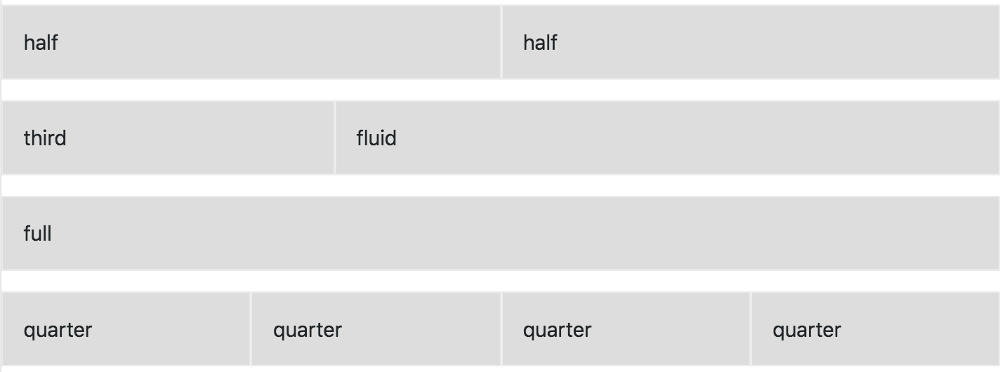

# Content Blocks

Content blocks are currently available on the [Basic Page](../page/index.md) content type.

## Actions

Each content block comes with actions which let you edit, remove or duplicate the content block.

Duplicating a content block will attempt to make a copy of everything within it, even other content blocks.

## Reorder
Content blocks can be reordered using the handle off to the left.

**Note**: You cannot drag an item to another level of nesting.

## Sections

Sections are top-level content blocks that wrap around and contain other content blocks.

### Section Administrative Title

 This isn't displayed to users, but is helpful when working with more than one section on a page.

### Add Content Blocks

By default, basic pages load with an initial section and text area content blocks. You add/remove content blocks in each section.

**Current out of the box content block types**

- Text
- Card
- Accordion
- Blockquote
- Events

### Articles

You will need to create a lot of articles to user the pager, filter by reference.

## Settings

Each content block has additional settings tucked away. These are all optional and set with defaults. Some settings differ based on the type of content block.

### Background Image

Available on sections, this allows you to place an image behind all nested content blocks within the section.

### Content width/alignment

Available in sections, these settings allow you to control the overall width and vertical/horiziontal alignment of nested content blocks.

### Column width

For each content block within a section (see below), the the width defaults to "Fluid." This means it will fill the horizontal space unless another content block within the same section gets in the way.

Two or more fluid content blocks will create divide the horizontal space up equally.

The other options, Full, Quarter, Third, Half will set and respect certain widths.

See the figure below to see how the content blocks in each section (row) can be configure to create custom layouts.

### Styles

Depending on the content block, a select box might be available that allows additional styles to be applied to the content block. Though multiple classes can be selected, they might conflict with each other.

### Unique ID

For each content block, a unique id can be created. Most commonly, these are used to create an anchor link to a particular area of a page.
