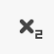
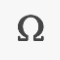
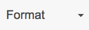
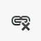
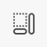

# WYSIWYG (What-You-See-Is-What-You-Get) Text Editor

The What-You-See-Is-What-You-Get (WYSIWYG) text editor gives you the ability to format your content and add links/media. This text editor is available on most text areas around the site.

## Basic Formatting

With the WYSIWYG text editor, it is easy to style your text with the bold, italic, strike-through, superscript, subscript options.

        

Additionally, you can insert special characters, and horizontal rules.

  

In most cases, the easiest way to change the text style is to select the text first and then to select one or more of the buttons on the editor toolbar.

These can be used in conjunction with each other or other buttons on the toolbar.

You can quickly remove all formatting from highlighted text using the "Remove Format" button.

 

### Headings

Using the "Paragraph Format" drop-down, you can add headings within your content. The heading will be applied to the current line/paragraph. Hit Enter/Return to break out and return to the normal format.

 

It is important for accessibility and usability that headings are used sequentially and not for style purposes. 

### Alignment

There are three options for text alignment. Left, center and right. Text is left-aligned by default. The alignment will continue until the next line break similar to headings.

   

### Lists

There are two types of lists you can create. Unordered (bullet points) and ordered (numbered).

  

To create a list, click on one of the list buttons. This will insert the first list item and you can start typing. For each additional item, press Return/Enter on your keyboard.

If you want to add another line to the same list item, press Shift+Return/Enter.

Additionally you can increase and decrease the indentation of the list.

  

To break out of the list and continue with other content, press Return/Enter twice.

## Links

Links to internal or external paths can be added with the link button. A separate configuration window will load.

 

- The _URL_ field will attempt to find related content/documents based on what is typed. If no suitable result is found and selected an normal link will be created.
- _Upload file_ will allow you to add a file that doesn't already exist on the site.
- _Advanced_ provides additional, though optional, configuration for the link.

You can edit an existing link by placing the cursor on the link and clicking the link button.

Links can also be removed easily with the "Unlink" button.

 

## Tables

A table is a structured set of data made up of of rows and columns (tabular data). A separate configuration window will load.

 

You can set initial row and column counts, designate the headers for the table and provide a table caption.

**Note**: Though not required, a caption is strongly recommended to provide an overall description of the data found in the table.

After initializing the table, you can enter data and/or right-click on the table to add additional rows/columns or edit table properties.

## Media (Images)

The "Media Entity Embed" (Image) button allows you to add new or existing images to your content. A separate configuration window will load.

 

When uploading an image, specify a name that can be used later on to find the image in the media library and choose an image.

After upload, provide alternative text for the image to aid visually impaired users.

Optionally, clicking on the image thumbnail allows you to specify the portion of an image that is most important. This information can be used when the image is cropped so that you don't, for example, end up with an image that cuts off the subject's head.

After saving the entity, another window will load allowing you to change the size of the image used, the alignment and allow you to provide a caption that is display with the image.

You can read more about media images and files within the [Media section of our documentation](../media/index.md).

## Editor Options

There are several other buttons available within the WYSIWYG text editor that allow you to control aspects of the editor window itself.

### Show Borders

This button will display borders around container HTML elements like paragraphs and divisions.

 

### Source

You can look under the hood at anytime to see the markup for the content. If you know your stuff you can write your own HTML staying within the restrictions of the filtered_html format.

 

You can see the available HTML tags/options on your site at /filter/tips.

HTML that is not allowed will be stripped out before rendering to site visitors.

### Maximize

This button will expand the text editor to use the full screen. This is helpful for distraction free writing, or working with a lot of content at once.

 
